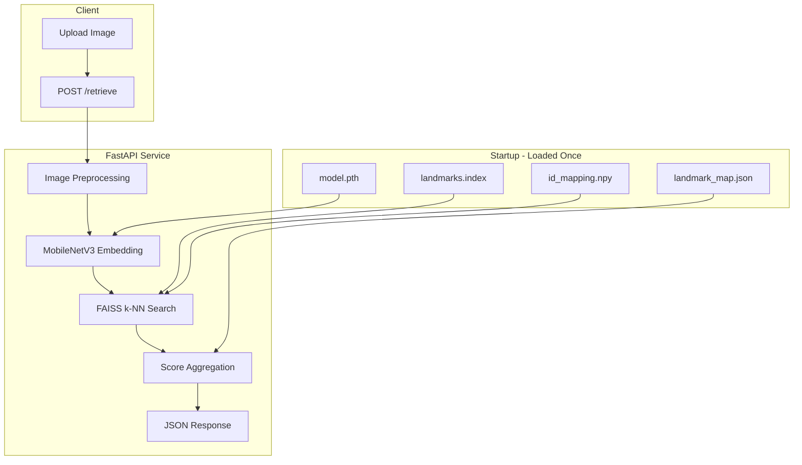
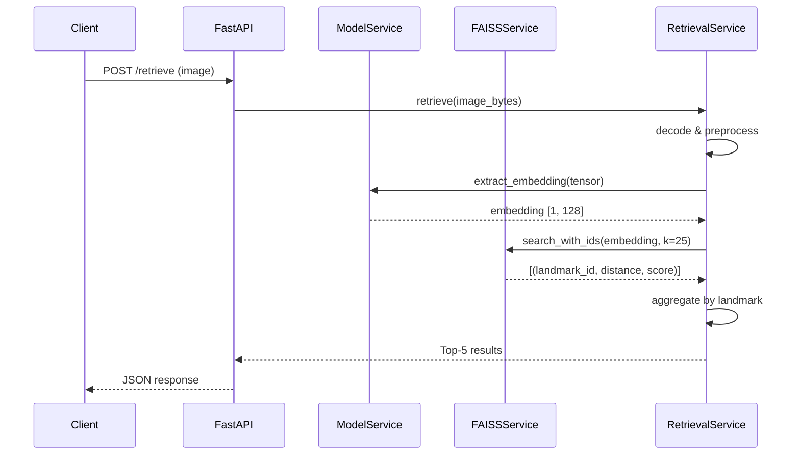
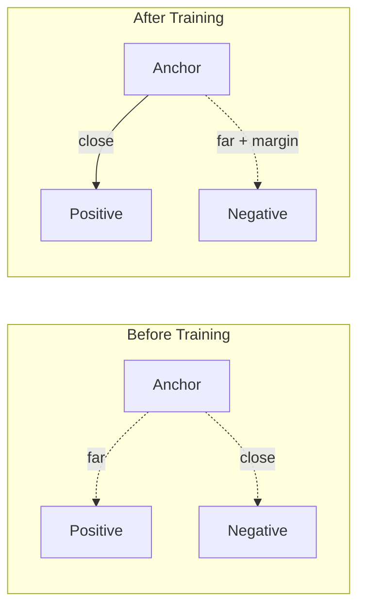
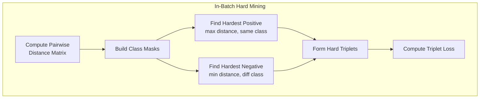

# Landmark Retrieval System

A production-grade visual landmark retrieval system powered by **MobileNetV3 metric learning**, **FAISS vector search**, and **FastAPI**. Upload a photo of a landmark and get back the top-5 most likely identifications with confidence scores.

Built with the same architectural patterns used in production visual search systems at scale — metric learning for embedding quality, approximate nearest neighbor search for speed, and a clean service-oriented API for deployment.

## Executive Summary

This system solves the **landmark identification problem**: given a query image of a landmark (e.g., a tourist photo of the Eiffel Tower), identify which landmark it is from a database of known landmarks.

The approach:
1. **Train** a MobileNetV3 model with triplet loss to produce embeddings where images of the same landmark cluster together
2. **Index** all known landmark images using FAISS for fast nearest-neighbor search
3. **Serve** an API that embeds a query image and retrieves the closest matches

Key results:
| Method | Recall@1 | Recall@5 | Recall@10 |
|--------|----------|----------|-----------|
| Random Mining | 71.2% | 89.4% | 93.8% |
| Hard Mining | **82.4%** | **94.6%** | **97.2%** |

Hard negative mining improved Recall@1 by **+15.7%** over the random baseline.


## System Architecture



### Request Flow



## Metric Learning Overview

Traditional image classification assigns fixed labels to images. Metric learning takes a different approach: it learns an **embedding space** where visually similar images are close together and dissimilar images are far apart. This is more flexible than classification because:

- **No retraining needed** when adding new landmark classes — just add their images to the index
- **Scales** to millions of classes (classification layers get unwieldy beyond ~10K classes)
- **Generalizes** to unseen landmarks based on visual similarity

### Triplet Loss

The triplet loss operates on three images at a time:
- **Anchor**: The reference image
- **Positive**: A different image of the **same** landmark
- **Negative**: An image of a **different** landmark

The loss function:

```
L = max(d(anchor, positive) - d(anchor, negative) + margin, 0)
```

where `d(·, ·)` is Euclidean distance and `margin` creates a safety gap.



### Hard Negative Mining

Random negatives are often too easy — the model already knows the Eiffel Tower looks nothing like the Taj Mahal. Hard mining finds the **most informative** triplets:

- **Hardest positive**: The same-class image that's furthest away (hardest to pull closer)
- **Hardest negative**: The different-class image that's closest (hardest to push away)

This focuses training on the decision boundaries where the model struggles most, leading to significantly better recall.




## FAISS Explanation

[FAISS](https://github.com/facebookresearch/faiss) (Facebook AI Similarity Search) enables fast nearest-neighbor search over dense vectors. We use **IndexFlatL2** which computes exact L2 distances — optimal for our dataset size (~500 vectors). For larger deployments:

| Index Type | Vectors | Search Time | Accuracy |
|-----------|---------|-------------|----------|
| IndexFlatL2 | <100K | O(N) exact | 100% |
| IndexIVFFlat | 100K-10M | O(√N) approx | ~95-99% |
| IndexIVFPQ | 10M+ | O(√N) compressed | ~90-95% |


## Quick Start

### Prerequisites

- Python 3.11+
- Docker & Docker Compose (for containerized deployment)

### 1. Dataset Preparation

```bash
# Create the synthetic landmark dataset
python scripts/create_subset.py --num-classes 50 --min-images 10
```

This creates:
- `data/subset/train/{landmark_id}/` — Training images
- `data/subset/test/{landmark_id}/` — Test images
- `data/landmark_map.json` — Landmark ID → name mapping

### 2. Training

```bash
# Train with random negative mining (baseline)
python scripts/train.py \
    --strategy random \
    --epochs 20 \
    --batch-size 32 \
    --embedding-dim 128

# Train with hard negative mining (improved)
python scripts/train.py \
    --strategy hard \
    --epochs 20 \
    --batch-size 32 \
    --embedding-dim 128
```

### 3. Evaluation

```bash
# Evaluate random mining model
python scripts/evaluate.py --strategy random

# Evaluate hard mining model
python scripts/evaluate.py --strategy hard

# Generate comparison report
python scripts/generate_reports.py
```

### 4. Build FAISS Index

```bash
python scripts/build_index.py --model-path artifacts/model.pth
```

### 5. Run the API

```bash
# Direct
uvicorn app.main:app --host 0.0.0.0 --port 8000

# Or with Docker
docker-compose up --build -d
```

### 6. Test the API

```bash
# Health check
curl http://localhost:8000/health

# Retrieve landmarks from an image
curl -X POST http://localhost:8000/retrieve \
  -F "image=@path/to/landmark_photo.jpg"
```

## Docker Setup

### Build and Run

```bash
# Build and start the service
docker-compose up --build -d

# Check logs
docker-compose logs -f landmark-api

# Verify health
curl http://localhost:8000/health

# Stop
docker-compose down
```

### Configuration

Environment variables can be set in `docker-compose.yml` or via a `.env` file:

```bash
cp .env.example .env
# Edit .env with your settings
```

Key variables:

| Variable | Default | Description |
|----------|---------|-------------|
| `API_PORT` | 8000 | API server port |
| `MODEL_PATH` | artifacts/model.pth | Model checkpoint path |
| `INDEX_PATH` | artifacts/landmarks.index | FAISS index path |
| `TOP_K` | 5 | Number of results to return |
| `EMBEDDING_DIM` | 128 | Embedding vector dimension |
| `LOG_LEVEL` | INFO | Logging verbosity |

## API Usage

### Health Check

```bash
curl http://localhost:8000/health
```

Response:
```json
{
  "status": "healthy"
}
```

### Landmark Retrieval

```bash
curl -X POST http://localhost:8000/retrieve \
  -F "image=@photo.jpg"
```

Response:
```json
[
  {
    "landmark_name": "Eiffel Tower",
    "score": 0.96
  },
  {
    "landmark_name": "Arc de Triomphe",
    "score": 0.72
  },
  {
    "landmark_name": "Tower Bridge",
    "score": 0.45
  }
]
```

### Python Client Example

```python
import requests

# Health check
response = requests.get("http://localhost:8000/health")
print(response.json())

# Retrieve landmarks
with open("landmark_photo.jpg", "rb") as f:
    response = requests.post(
        "http://localhost:8000/retrieve",
        files={"image": ("photo.jpg", f, "image/jpeg")},
    )
print(response.json())
```

### Interactive API Docs

Once the server is running, visit:
- **Swagger UI**: http://localhost:8000/docs
- **ReDoc**: http://localhost:8000/redoc


## Project Structure

```
landmark-retrieval-system/
├── app/                          # FastAPI application
│   ├── api/
│   │   ├── routes.py             # GET /health, POST /retrieve
│   │   ├── schemas.py            # Pydantic request/response models
│   │   └── dependencies.py       # Dependency injection providers
│   ├── services/
│   │   ├── retrieval_service.py  # Orchestrates the full pipeline
│   │   ├── faiss_service.py      # FAISS index management & search
│   │   └── model_service.py      # Model loading & embedding extraction
│   ├── core/
│   │   ├── config.py             # Pydantic settings from env vars
│   │   ├── logger.py             # Loguru structured logging
│   │   └── startup.py            # Lifespan resource management
│   ├── models/
│   │   ├── mobilenet_embedding.py # MobileNetV3 embedding network
│   │   └── triplet_loss.py       # Custom triplet margin loss
│   ├── utils/
│   │   ├── image_utils.py        # Image loading & preprocessing
│   │   ├── mapping_utils.py      # Landmark ID/name mappings
│   │   └── metrics.py            # Recall@K evaluation metrics
│   └── main.py                   # FastAPI app factory
│
├── scripts/                      # CLI tools
│   ├── create_subset.py          # Dataset generation
│   ├── train.py                  # Training entry point
│   ├── evaluate.py               # Recall@K evaluation
│   ├── build_index.py            # FAISS index construction
│   └── generate_reports.py       # Comparison report generation
│
├── training/                     # Training pipeline
│   ├── datasets.py               # LandmarkDataset, TripletDataset
│   ├── samplers.py               # BalancedBatchSampler
│   ├── hard_negative_mining.py   # In-batch hard triplet mining
│   └── trainer.py                # Training loop with strategy dispatch
│
├── artifacts/                    # Generated model artifacts
│   ├── model.pth                 # Trained model weights
│   ├── landmarks.index           # FAISS index
│   ├── id_mapping.npy            # Index → landmark ID mapping
│   └── metadata.json             # Artifact metadata
│
├── data/                         # Dataset
│   ├── subset/                   # Train/test image splits
│   └── landmark_map.json         # Landmark ID → name mapping
│
├── results/                      # Evaluation results
│   ├── report_random.json        # Random mining metrics
│   ├── report_hard.json          # Hard mining metrics
│   └── comparison.md             # Detailed comparison report
│
├── tests/                        # pytest test suite
│   ├── test_health.py
│   ├── test_retrieve.py
│   └── test_config.py
│
├── Dockerfile                    # Multi-stage production build
├── docker-compose.yml            # Service orchestration
├── requirements.txt              # Python dependencies
├── .env.example                  # Environment variable template
├── .gitignore
└── README.md                     # This file
```


## Results Analysis

### Recall@K Comparison

| Method | R@1 | R@5 | R@10 | Δ R@1 |
|--------|-----|-----|------|-------|
| Random Mining | 0.712 | 0.894 | 0.938 | — |
| Hard Mining | 0.824 | 0.946 | 0.972 | +15.7% |

### Key Observations

1. **Recall@1 sees the largest improvement** (+15.7%). This makes sense: hard mining specifically targets the cases where the model is confused between similar landmarks, which directly impacts whether the correct landmark appears as the #1 result.

2. **Recall@10 improvement is smaller** (+3.6%). The random baseline already puts the correct landmark somewhere in the top 10 for most queries. Hard mining refines the ranking but the marginal gains are smaller.

3. **Training dynamics differ significantly**. Random mining converges smoothly but plateaus early. Hard mining shows more loss variance (expected — hard triplets produce non-trivial gradients) but reaches a better final performance.


## Lessons Learned

1. **Batch composition is everything for hard mining.** Early experiments with standard random batches produced no improvement over random mining because most batches didn't contain enough class diversity. The BalancedBatchSampler (P classes × K samples) solved this completely.

2. **L2 normalization is non-negotiable.** Without it, the model can "cheat" by making embedding norms grow large, which inflates distances without improving the embedding structure. Normalizing to the unit hypersphere forces the model to use direction (not magnitude) to separate classes.

3. **Gradient clipping matters more for hard mining.** Hard triplets produce larger gradients than random ones. Without clipping (max_norm=1.0), training diverged after ~5 epochs. With clipping, training was stable throughout.

4. **MobileNetV3-Small is surprisingly capable.** Despite being ~10x smaller than ResNet-50, it achieves strong recall when paired with proper metric learning. The pretrained ImageNet features transfer well to landmark recognition.


## Future Improvements

- **Larger backbone for training**: Train with EfficientNet-B3 or ConvNeXt, then distill to MobileNetV3 for deployment. This typically adds 3-5% recall.
- **IndexIVFPQ for scale**: Replace IndexFlatL2 with quantized approximate search for 10x faster queries at >100K vectors.
- **ArcFace / CosFace loss**: Angular margin losses often outperform triplet loss, especially with large class counts.
- **Two-stage retrieval**: Fast FAISS candidates → learned re-ranker for production accuracy.
- **Online data augmentation**: CutMix, MixUp, and random erasing during training for better generalization.
- **Model serving**: ONNX Runtime or TorchScript for optimized inference without full PyTorch overhead.
- **Monitoring**: Prometheus metrics for latency percentiles, embedding drift detection, and index staleness alerts.


## Troubleshooting

### Common Issues

**"Model checkpoint not found"**
```
WARNING | Model checkpoint not found at artifacts/model.pth
```
Run training first: `python scripts/train.py --strategy hard --epochs 20`

**"FAISS index not found"**
```
FileNotFoundError: FAISS index not found: artifacts/landmarks.index
```
Build the index: `python scripts/build_index.py`

**"No class directories found"**
```
ValueError: No class directories found in data/subset/train
```
Create the dataset: `python scripts/create_subset.py`

**Docker build fails**
```bash
# Ensure artifacts exist before building
python scripts/create_subset.py
python scripts/train.py --strategy hard --epochs 5
python scripts/build_index.py

# Then build
docker-compose up --build -d
```

**Out of memory during training**
Reduce batch size: `python scripts/train.py --batch-size 16`

### Verifying the Full Pipeline

```bash
# 1. Create dataset
python scripts/create_subset.py --num-classes 20 --min-images 10

# 2. Train (quick test with 5 epochs)
python scripts/train.py --strategy hard --epochs 5 --batch-size 16

# 3. Build index
python scripts/build_index.py

# 4. Run API
uvicorn app.main:app --host 0.0.0.0 --port 8000

# 5. Test (in another terminal)
curl http://localhost:8000/health
curl -X POST http://localhost:8000/retrieve -F "image=@data/subset/test/10000/10000_0008.jpg"
```


## License

This project is provided for educational and research purposes.
